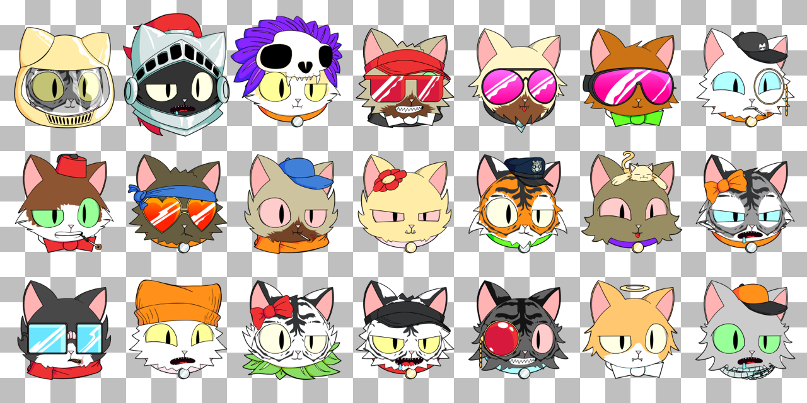

# PCC Cats - Transparent Bg

This repository contains PCC Cats with transparent background.

Please use for fun and build around PCC.

## Specs

| Size          | Format | File ID Range |
| ------------- | ------ | ------------- |
| 500 × 500px   | PNG    | [0, 10002]    |
| 1000 × 1000px | WebP   | [0, 10000]    |

> ID [0] is a transparent placeholder
> ID [10001, 10002] are not part of the NFTs minted
> ID [10001, 10002] are only available in PNG format now

## How to use

Use `raw.githubusercontent.com` To access an image file:

`https://raw.githubusercontent.com/CuratorCat/pcc-cats-nobg/main/{sizeDir}/{id}.{ext}`

### e.g. Cat `66`:

- 500 × 500px, PNG: https://raw.githubusercontent.com/CuratorCat/pcc-cats-nobg/main/w500/66.png
- 1000 × 1000px, WebP: https://raw.githubusercontent.com/CuratorCat/pcc-cats-nobg/main/w1000/66.webp

### e.g. Cat `7926`:

- 500 × 500px, PNG: https://raw.githubusercontent.com/CuratorCat/pcc-cats-nobg/main/w500/7926.png
- 1000 × 1000px, WebP: https://raw.githubusercontent.com/CuratorCat/pcc-cats-nobg/main/w1000/7926.webp

### e.g. Cat `9455`:

- 500 × 500px, PNG: https://raw.githubusercontent.com/CuratorCat/pcc-cats-nobg/main/w500/9455.png
- 1000 × 1000px, WebP: https://raw.githubusercontent.com/CuratorCat/pcc-cats-nobg/main/w1000/9455.webp

## Copyright

Purrnelope's Country Club (https://www.purrnelopescountryclub.com/) is the creator of the original artwork and owns the copyright.

Files in this repo are created by curatorcat.pcc.eth for PCC community use only.
